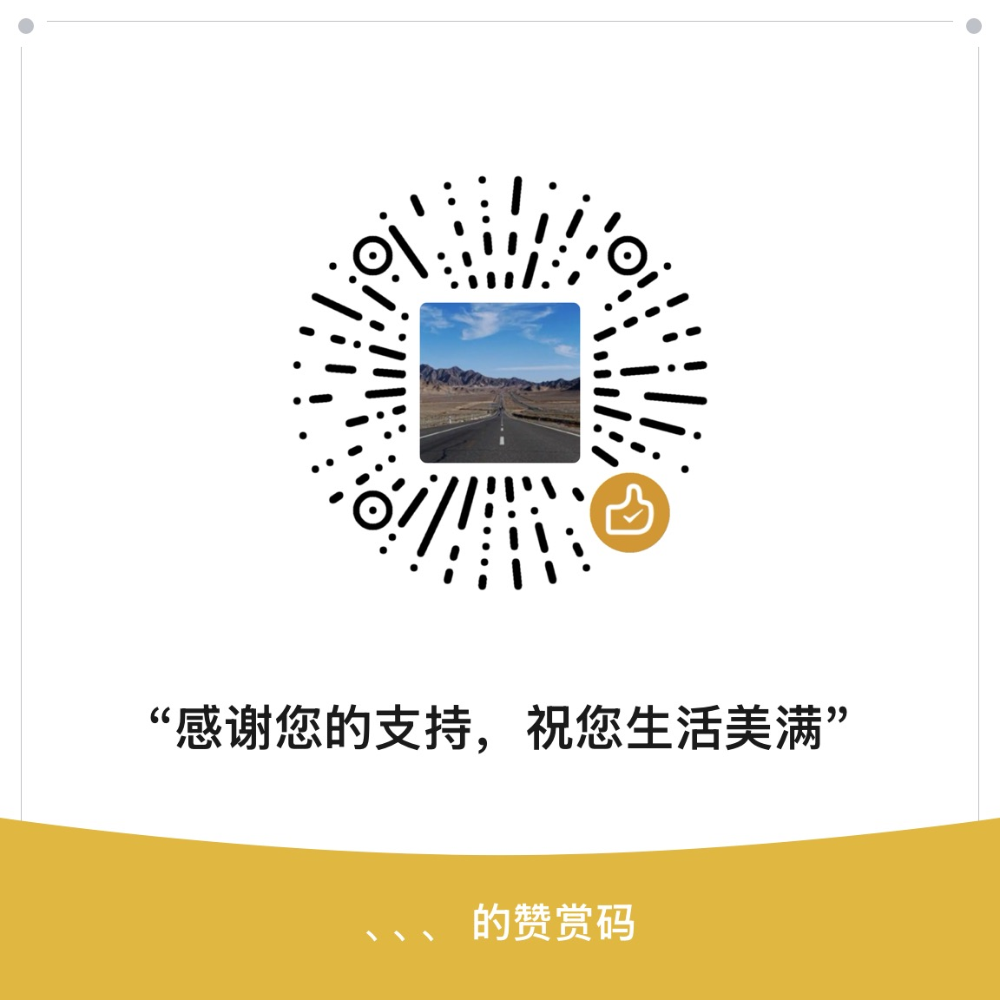

<p align="center">
  <h1 align="center">VibeOS</h1>
  <p align="center">
    <strong>AI-Native Software Development Lifecycle Platform</strong>
  </p>
  <p align="center">
    Give every team an AI-native R&D system — not just Big Tech.
  </p>
  <p align="center">
    <a href="LICENSE"></a>
    <a href="#quick-start"></a>
    <a href="https://github.com/anthropics/vibeos/pulls"></a>
  </p>
</p>

---

VibeOS is an open-source platform that brings **8 specialized AI agents** to cover your entire software development lifecycle — from requirements to monitoring. Unlike code completion tools (Copilot, Cursor) or single-task agents (Devin), VibeOS orchestrates the **full SDLC** with cross-project memory that makes agents smarter over time.

**3 commands to a running AI R&D platform:**

```bash
make install && make infra && make dev
# Open http://localhost:3000
```

> **Early-stage notice:** VibeOS is under active development. You may encounter rough edges and occasional bugs. But it's battle-tested enough to demonstrate what AI-native SDLC looks like — and to give your team a real head start on AI infrastructure transformation. Issues and PRs are welcome.

## Why VibeOS

### Full SDLC Coverage, Not Just Code Completion

8 specialized AI agents spanning the entire delivery lifecycle:

```
PM Agent → Architecture → Requirements → Design → Development → Testing → CI/CD → Monitoring
```

While Copilot helps you write code faster, VibeOS helps your **entire team** ship products faster.

### Multi-Agent Orchestration with Memory

- Agents collaborate through a **graph-based workflow engine**
- **Cross-workspace memory** (Mem0 + Qdrant) — agents get smarter with every project
- **Knowledge distillation** turns execution history into reusable institutional knowledge via Apache AGE graph

### LLM-Agnostic, Works Everywhere

| Provider | Models | Region |
|----------|--------|--------|
| OpenAI | GPT-4o, etc. | Global |
| Anthropic | Claude Sonnet/Opus | Global |
| DeepSeek | DeepSeek-Chat/Coder | Global / China |
| Volcengine | Doubao series | China |
| Dashscope | Qwen series | China |
| Any OpenAI-compatible | Custom | Anywhere |

Built-in **model routing** with capability contracts, **token budget control**, and **circuit breaker** via llm-gateway.

### Production-Ready Architecture, Not a Toy

- **Go** backend services (workspace-svc, ws-gateway) for performance
- **Python** agents and platform services for AI flexibility
- **React 19** frontend with real-time WebSocket collaboration
- **PostgreSQL** + **Redis** + **Qdrant** — proven infrastructure stack
- **Docker Compose** one-command deployment

### Agentic Coding with Full Repo Access

- coding-agent powered by **OpenHands SDK** — not just file snippets, full repository operations
- GitLab integration for real branch/MR workflows
- Guard hooks and stuck detection for safe autonomous coding

### Open and Extensible

- Add custom **agents**, **tools**, and **workflow phases**
- Optional integrations: GitLab, Feishu/Lark, Tencent COS
- **Apache 2.0** — use it, fork it, build on it

## Comparison

| Capability | VibeOS | GitHub Copilot | Cursor | Devin |
|-----------|--------|---------------|--------|-------|
| Code completion | via coding-agent | Yes | Yes | Yes |
| Requirements analysis | Yes | - | - | - |
| Architecture design | Yes | - | - | - |
| Full SDLC workflow | Yes | - | - | Partial |
| Multi-agent orchestration | Yes | - | - | - |
| Cross-project memory | Yes | - | - | - |
| Knowledge graph | Yes | - | - | - |
| Self-hosted / open source | Yes | - | - | - |
| LLM provider choice | Any | OpenAI | Multiple | Proprietary |

## Architecture

```
┌──────────────────────────────────────────────────────────┐
│                    Frontend (React 19)                    │
│            Vite 8 · TypeScript · Tailwind 4              │
│                     localhost:3000                        │
└────────┬──────────────────┬───────────────┬──────────────┘
         │ /api/*           │ /api/nlp,     │ /ws
         │                  │ /api/workflow, │
         │                  │ /api/feedback  │
         ▼                  ▼                ▼
┌─────────────┐   ┌─────────────┐   ┌──────────────┐
│workspace-svc│   │  pm-agent   │   │ ws-gateway   │
│   (Go/Chi)  │   │  (FastAPI)  │   │  (Go/WS)     │
│   :8010     │   │   :8040     │   │   :8020      │
└──────┬──────┘   └──────┬──────┘   └──────┬───────┘
       │                 │                  │
       │          ┌──────┴──────┐           │
       │          │  Dispatcher │           │
       │          └──────┬──────┘           │
       │     ┌───────────┼───────────┐      │
       │     ▼           ▼           ▼      │
       │  ┌──────┐  ┌──────────┐ ┌──────┐  │
       │  │arch  │  │dev-agent │ │ ...  │  │
       │  │:8041 │  │  :8044   │ │agents│  │
       │  └──────┘  └──────────┘ └──────┘  │
       │                 │                  │
       ▼                 ▼                  ▼
┌──────────┐  ┌───────────────┐  ┌──────────────┐
│PostgreSQL│  │  llm-gateway  │  │    Redis      │
│  :5432   │  │   :8030       │  │    :6379      │
└──────────┘  └───────────────┘  └──────────────┘
                     │
       ┌─────────────┼─────────────┐
       ▼             ▼             ▼
┌──────────┐  ┌────────────┐  ┌──────────────┐
│ memory-  │  │rag-pipeline│  │ knowledge-   │
│ service  │  │   :8060    │  │  service     │
│  :8050   │  └─────┬──────┘  │   :8070      │
└────┬─────┘        │         └──────┬───────┘
     │              │                │
     ▼              ▼                ▼
┌──────────┐  ┌──────────┐   ┌──────────────┐
│  Qdrant  │  │  Qdrant  │   │  PostgreSQL  │
│  :6333   │  │  :6333   │   │  (AGE graph) │
└──────────┘  └──────────┘   └──────────────┘
```

## Quick Start

### Prerequisites

| Tool | Version | Install |
|------|---------|---------|
| Docker | Latest | [docker.com](https://docs.docker.com/get-docker/) |
| Go | 1.25+ | [go.dev](https://go.dev/dl/) |
| Python | 3.12+ | [python.org](https://www.python.org/downloads/) |
| uv | Latest | [docs.astral.sh/uv](https://docs.astral.sh/uv/) |
| Node.js | 20+ | [nodejs.org](https://nodejs.org/) |
| pnpm | 9+ | `npm install -g pnpm` |

### 1. Clone and Configure

```bash
git clone https://github.com/anthropics/vibeos.git
cd vibeos
cp .env.example .env
```

Edit `.env` and configure your LLM provider (at minimum, set one API key):

```bash
# Pick your provider — examples:
LLM_API_KEY=sk-xxxx                          # OpenAI
LLM_BASE_URL=https://api.openai.com/v1
LLM_MODEL=gpt-4o

# Or for DeepSeek:
# LLM_API_KEY=sk-xxxx
# LLM_BASE_URL=https://api.deepseek.com/v1
# LLM_MODEL=deepseek-chat
```

See [.env.example](.env.example) for all provider options.

### 2. Install and Launch

```bash
make install          # Install all dependencies (Python + JS + Go)
make infra            # Start Postgres, Redis, Qdrant via Docker
make db-init          # Initialize database schema (first time only)
make db-migrate       # Apply migrations
make dev              # Start all services + frontend
```

### 3. Verify

```bash
make health           # Check all service endpoints
```

Open [http://localhost:3000](http://localhost:3000) in your browser.

Run `make help` to see all available targets.

### Starting Services Individually

```bash
make run-workspace-svc       # Go  :8010
make run-ws-gateway          # Go  :8020
make run-llm-gateway         # Py  :8030
make run-memory-service      # Py  :8050
make run-rag-pipeline        # Py  :8060
make run-knowledge-service   # Py  :8070
make run-pm-agent            # Py  :8040
make run-architecture-agent  # Py  :8041
make run-dev-agent           # Py  :8044
make run-coding-agent        # Py  :8048
make run-web                 # JS  :3000
```

## Configuration

### LLM Provider

VibeOS routes all LLM calls through `llm-gateway`, which supports any OpenAI-compatible API. Configure via environment variables:

| Variable | Description | Example |
|----------|-------------|---------|
| `LLM_API_KEY` | API key for your LLM provider | `sk-xxxx` |
| `LLM_BASE_URL` | Base URL of the provider API | `https://api.openai.com/v1` |
| `LLM_MODEL` | Default model name | `gpt-4o` |

For provider-specific keys (e.g. using multiple providers simultaneously), you can also set `OPENAI_API_KEY`, `ANTHROPIC_API_KEY`, `DEEPSEEK_API_KEY`, `VOLCENGINE_API_KEY` individually.

### Optional Integrations

| Integration | Required Env Vars | Purpose |
|-------------|------------------|---------|
| **GitLab** | `GITLAB_URL`, `GITLAB_TOKEN` | Code repository management, branch/MR workflows |
| **Feishu/Lark** | `FEISHU_APP_ID`, `FEISHU_APP_SECRET` | Create Feishu docs from agent outputs |
| **Tencent COS** | `VIBEOS_COS_UPLOAD=1`, `COS_*` vars | Upload artifacts to cloud storage |

### Service Ports

| Service | Port | Role |
|---------|------|------|
| Frontend (Vite) | 3000 | React SPA |
| workspace-svc | 8010 | REST API |
| ws-gateway | 8020 | WebSocket relay |
| llm-gateway | 8030 | LLM proxy |
| pm-agent | 8040 | Orchestrator |
| architecture-agent | 8041 | Architecture phase |
| requirement-agent | 8042 | Requirement phase |
| design-agent | 8043 | Design phase |
| dev-agent | 8044 | Development phase |
| test-agent | 8045 | Testing phase |
| cicd-agent | 8046 | CI/CD phase |
| monitoring-agent | 8047 | Monitoring phase |
| coding-agent | 8048 | Agentic coding |
| memory-service | 8050 | Memory (Mem0 + Qdrant) |
| rag-pipeline | 8060 | RAG indexing & retrieval |
| knowledge-service | 8070 | Knowledge graph |

## Technology Stack

| Layer | Technology | Purpose |
|-------|-----------|---------|
| **Frontend** | React 19, Vite 8, TypeScript, Tailwind 4, Zustand | SPA with real-time WebSocket updates |
| **API Gateway** | Go, Chi router | Workspace/task CRUD, auth |
| **WebSocket** | Go, gorilla/websocket, Redis Pub/Sub | Real-time event broadcasting |
| **Agent Orchestrator** | Python, FastAPI, LangGraph | Multi-agent workflow dispatch |
| **Domain Agents** | Python, FastAPI | Per-phase AI agents |
| **LLM Gateway** | Python, LiteLLM | Multi-provider routing, budget control |
| **Memory** | Python, Mem0, Qdrant | Four-layer memory system |
| **RAG** | Python, LlamaIndex, Qdrant | Per-workspace document indexing |
| **Knowledge** | Python, Apache AGE, PostgreSQL | Knowledge graph + distillation |
| **Database** | PostgreSQL 16 (with AGE extension) | Relational + graph data |
| **Cache/PubSub** | Redis 7 | Sessions, events, trust scores |
| **Vector Store** | Qdrant | Memory embeddings, RAG chunks |

## Memory & Knowledge Architecture

VibeOS implements a multi-layered learning system where agents get smarter with every project:

```
Agent executes task
    ↓
┌─ add_memory() ─────────→ Mem0 (Project Memory, per workspace)
│
├─ _save_artifact() ──────→ RAG Pipeline (auto-indexed)
│                              ↓
│                          Qdrant (per-workspace collection)
│
├─ workflow:phase_complete → async _trigger_distill()
│                              ↓
│                          Knowledge Service (LLM extracts patterns)
│                              ↓
│                          AGE Graph (cross-workspace knowledge)
│
├─ workflow:task_complete ─→ async _auto_index_to_rag()
│
└─ user feedback (thumbs up/down) → PM Agent → Memory Service
                              ↓
                          Preference Memory (improves future outputs)
```

| Layer | Scope | Storage | Purpose |
|-------|-------|---------|---------|
| L1 Working | Session | Mem0 (session_id) | Short-lived conversation context |
| L2 Project | Workspace | Mem0 (ws:{id}) | Tech stack, patterns, decisions |
| L3 Organization | Global | Mem0 (org:{id}) | Cross-workspace best practices |
| L4 Preference | Workspace | Mem0 (ws:{id}) | User feedback on agent outputs |

## Project Structure

```
vibeos/
├── apps/web/                     # React 19 SPA (pnpm workspace)
├── agents/                       # Python AI agents (uv workspace)
│   ├── shared/vibeos_agent/      # Shared agent SDK
│   ├── pm-agent/                 # Orchestrator (NLP + workflow)
│   ├── coding-agent/             # Agentic coding (OpenHands)
│   ├── architecture-agent/       # Architecture phase
│   ├── requirement-agent/        # Requirement phase
│   ├── design-agent/             # Design phase
│   ├── dev-agent/                # Development phase
│   ├── test-agent/               # Testing phase
│   ├── cicd-agent/               # CI/CD phase
│   └── monitoring-agent/         # Monitoring phase
├── services/                     # Go backend services
│   ├── workspace-svc/            # REST API (Chi router)
│   ├── ws-gateway/               # WebSocket relay
│   └── shared/models/            # Shared DTOs
├── platform/                     # Python platform services
│   ├── llm-gateway/              # Multi-provider LLM routing
│   ├── memory-service/           # Mem0 + Qdrant
│   ├── rag-pipeline/             # LlamaIndex + Qdrant
│   └── knowledge-service/        # Knowledge graph (AGE)
├── deploy/                       # Docker, SQL, migrations
├── Makefile                      # Dev workflow automation
├── .env.example                  # Environment template
└── LICENSE                       # Apache 2.0
```

## Contributing

We welcome contributions! Please see [CONTRIBUTING.md](CONTRIBUTING.md) for guidelines.

## License

VibeOS is licensed under the [Apache License 2.0](LICENSE).

## Support the Project

If VibeOS helps your team, consider buying me a coffee. Your support keeps this project maintained and free for everyone.

<p align="center">
  <a href="https://buymeacoffee.com/qianlei"></a>
</p>

<p align="center">
  
</p>

<p align="center"><em>No pressure — starring the repo is already a huge help!</em></p>

---

## 中文说明

VibeOS 是一个 AI 原生的软件开发生命周期平台，通过 **8 个专业 AI Agent** 协作完成从需求分析到持续监控的全流程。

与代码补全工具（Copilot、Cursor）或单任务 Agent（Devin）不同，VibeOS 编排 **完整的 SDLC 流程**，并具备跨项目的记忆积累能力，让 Agent 在反复执行任务的过程中持续变好。

### 核心特性

- **全生命周期覆盖**：PM → 架构 → 需求 → 设计 → 开发 → 测试 → CI/CD → 监控
- **多 Agent 协同**：基于图的工作流引擎，Agent 间上下文自动传递
- **跨项目记忆**：Mem0 + Qdrant 四层记忆体系，越用越聪明
- **知识蒸馏**：Apache AGE 知识图谱，自动提炼组织级最佳实践
- **LLM 无关**：支持 OpenAI、Anthropic、DeepSeek、火山引擎等任意 OpenAI 兼容 API
- **生产级架构**：Go + Python + React 19 微服务架构，Docker Compose 一键部署

### 快速开始

```bash
cp .env.example .env    # 配置 LLM API Key
make install            # 安装依赖
make infra              # 启动基础设施（Postgres、Redis、Qdrant）
make db-init            # 初始化数据库（仅首次）
make db-migrate         # 应用迁移
make dev                # 启动所有服务
# 访问 http://localhost:3000
```

### 适合谁

- 想要搭上 AI Infra 转型列车的 **中小型公司**
- 希望在内部构建 AI 原生研发体系的 **技术团队**
- 对 AI Agent 工作流感兴趣的 **开发者和研究者**

> VibeOS 仍在积极开发中，可能存在一些粗糙的边角。但它已经足够展示 AI 原生 SDLC 的样子，帮助你的团队抢先一步。欢迎提 Issue 和 PR！
